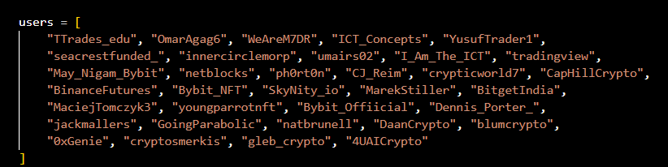
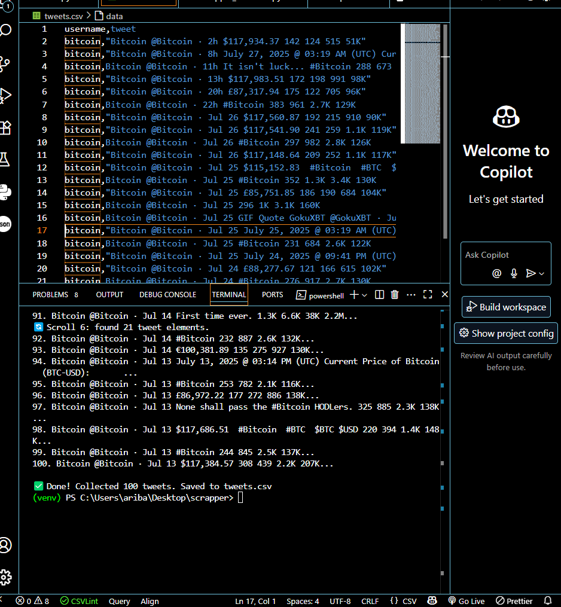
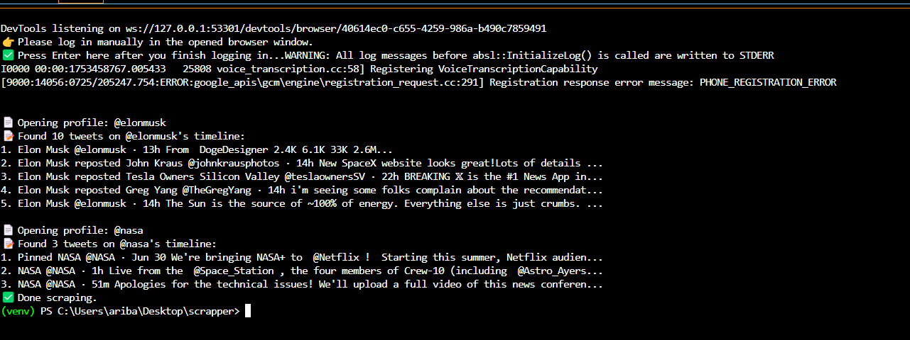

📌 Overview  
This project collects data from **Twitter** and **Reddit** to analyze sentiment around **cryptocurrency** and **forex markets**.  
The goal is to provide **accurate market predictions** by combining real-time social media sentiment with financial trend analysis.  

---

## 🔧 Tools & Technologies  
- **Selenium** – Automates browsing for scraping tweets when direct APIs are limited.  
- **snscrape** – Lightweight scraping tool to fetch tweets based on keywords, hashtags, or accounts.  
- **PRAW (Python Reddit API Wrapper)** – Fetches posts & comments from Reddit.  
- **NLTK / TextBlob / VADER** – Sentiment analysis on collected text data.  
- **Pandas & NumPy** – Data preprocessing, cleaning, and structuring.  
- **Matplotlib / Seaborn** – Visualizing sentiment trends.  

---

## 🚀 Features  
- Scrapes **Twitter tweets** using:  
  - `Selenium` (for automation when snscrape is restricted)  
  - `snscrape` (for faster collection of tweets)  
- Ability to filter by:  
  - Verified Twitter accounts  
  - Specific hashtags (e.g., `#Bitcoin`, `#Ethereum`, `#Forex`)  
  - Custom keywords  
- Reddit data collection from chosen subreddits.  
- Sentiment classification (**Positive, Negative, Neutral**).  
- Trend visualization for better **market prediction**.  

---

## 📂 Project Flow  
1. **Data Collection**  
   - Twitter (via Selenium & snscrape)  
   - Reddit (via PRAW API)  
2. **Filtering**  
   - Only tweets from **verified accounts**  
   - Relevant hashtags for **accuracy**  
3. **Preprocessing**  
   - Cleaning text (removing links, emojis, special characters)  
   - Tokenization & stop-word removal  
4. **Sentiment Analysis**  
   - VADER/TextBlob sentiment scoring  
   - Classify tweets & posts into **Positive, Neutral, Negative**  
5. **Visualization**  
   - Graphs showing sentiment trends  
   - Correlation with crypto/forex price movements  
6. **Prediction**  
   - Sentiment-driven insights for **market movement prediction**  

---

## 📊 Example Use Case  
- Scrape tweets with `#Bitcoin` from verified accounts.  
- Collect Reddit discussions from **r/CryptoCurrency**.  
- Analyze sentiment → **70% Positive, 20% Neutral, 10% Negative**.  
- Visualize trend → Bitcoin price likely to **rise short-term**.  

---

### 🔹 Twitter Usernames (Selected for Scraping)
Below are the verified Twitter accounts chosen for accurate crypto/forex predictions:  
  

---

### 🔹 Real-Time Scraping in Action
Screenshots of Selenium scraping tweets in real-time:  

  
---

### 🔹 CSV Data Output
Collected data is stored in CSV files for further processing:  

  
---

## 📊 Future Work
- Adding ML-based predictive models  
- Expanding to other social media platforms  
- Dashboard visualization for live sentiment trends  

---

## 🤝 Contribution
Pull requests are welcome! Please make sure to open an issue first for discussions.  

---

## 📜 License
This project is licensed under the MIT License.
